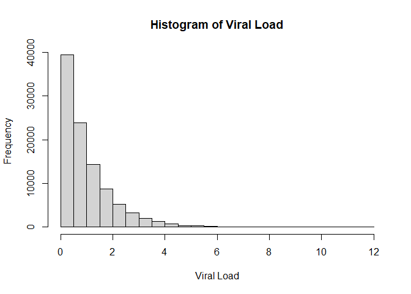
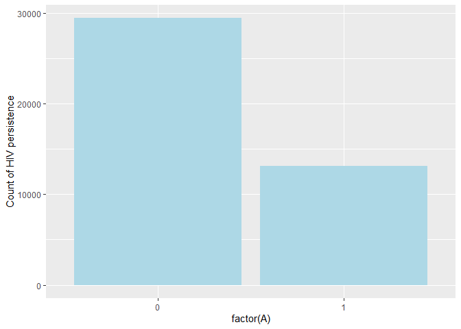
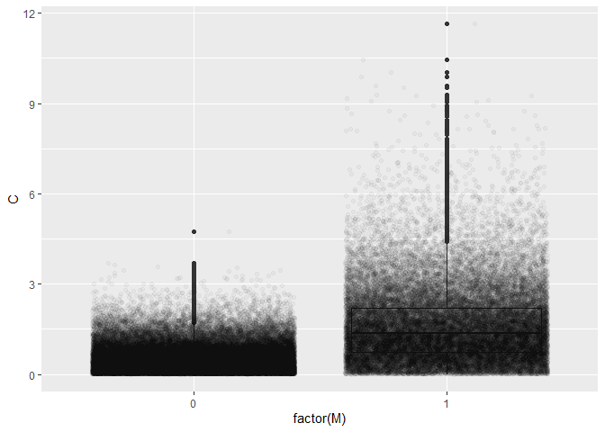
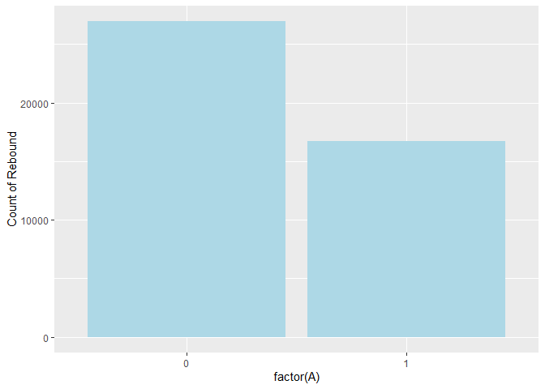
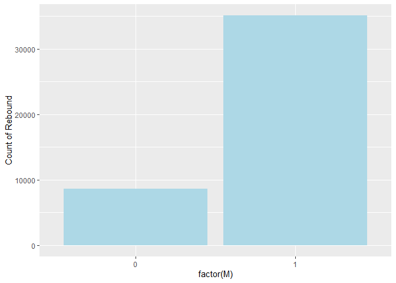
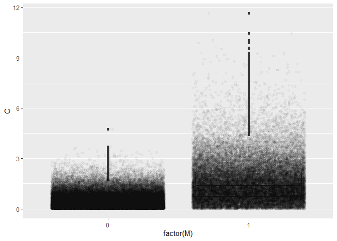

Exploratory Simulations (HIV example)
================

In this document we simulate an analysis similar to the HIV-curative
treatments described by Lok and Bosch.

Here we let $A$ be the curative HIV therapy on ART, $\bar{M}$ to be HIV
persistence, $C$ to be pre-ART viral load, and $Y$ time to viral
rebound.

Here, $Y$ is binary (suppressed or not suppresed after 4 weeks of ART
interruption). $\bar{M}$ is also binary; whether HIV persistence is
below a certain threshold.

## Simulation Parameters

-   Treatment $A$ is deterministic assigned to half the population at
    random
-   $\bar{M}$ will be simulated according to a logistic regression model
    with Pre-ART viral load and curative therapy as covariates.
-   Pre-ART viral load $C$ will be simulated according to some
    nonnegative distribution (such as gamma)
-   Virulogic Outcome will be simulated according to a logistic
    regression model with $\bar{M}$ and $A$ as covariates.

### Load Packages

``` r
library(tidyverse) # mostly for tibbles and visualizations
```

### Parameters

Parameters are chosen arbitrarily.

**Sample Size:**

``` r
n = 100000
A <- 1:n < n/2 # Assign Curative treatment to half the sample
```

**Shape/Rate Parameters for Pre-ART viral load $C$:**

``` r
alpha <-  1 # Shape
beta <-  1  # Rate
```

**Logistic Model for $\bar{M}$:**

$$log\bigg(\frac{P(\bar{M} = 1|A,C)}{1-P(\bar{M} = 1|A,C)}\bigg)=\beta_1+\beta_2 A+\beta_3 C$$

``` r
b_0 <- log(0.2/(1-0.2)) # Probability of persistence is low when viral load is ~0  and there is no treatment
b_1 <- log(1/10) # Treatment 1/5ths the odds of persistence
b_2 <- log(10) # An increase of viral load by 1 multiplies odds of persistence by 10
```

**Logistic Model for $Y$:**

$$log\bigg(\frac{P(Y = 1|A,\bar{M},C)}{1-P(Y = 1|A,M,C)}\bigg)=\alpha_1+\alpha_2 A+\alpha_3 C+\alpha_4\bar{M}$$

``` r
a_0 <- log(0.05/(1-0.05)) # Probability of viral rebound is low when viral load is ~0  and there is no treatment and HIV is not persistent
a_1 <- log(1/2) # treatment halves the odds of rebound
a_2 <- log(10) # an increase of viral load by 1 multiplies odds of viral rebound by 10
a_3 <- log(10) # If HIV is persistent, odds of viral rebound multiply by 10.
```

### Example of Simulated Dataset

Viral load is simulated from the gamma distribution. An *example* of
this distribution is shown below.

``` r
simulate_C <- function(){rgamma(n,alpha,beta)}

Cause <- simulate_C()
hist(Cause,breaks = 20, main = "Histogram of Viral Load", xlab = "Viral Load")
```

<!-- -->

**Model for $\bar{M}$:**

We simulate the dataset to get a sense of the distribution of $M$ and
its dependency on $A$ and $C$.

``` r
X_AC <- matrix(c(rep(1,n),A*1,Cause),ncol = 3) # Design matrix for logistic regression model
  
simulate_M <- function(X_AC){
  # Simulate Mediator Values given Design Matrix X_AC

  log_odds <- X_AC %*% c(b_0,b_1,b_2) # resulting Log Odds
  p <- exp(log_odds)/(1+exp(log_odds)) # resulting probability of M = 1
  M <- rbinom(n,1,p) # Simulate M
  
  return(M)
  
}

M <- simulate_M(X_AC)

# Visualize ----------------------------------------------
X_AC <- cbind(X_AC,M) 
X_AC <- as_tibble(X_AC)
```

    ## Warning: The `x` argument of `as_tibble.matrix()` must have unique column names if
    ## `.name_repair` is omitted as of tibble 2.0.0.
    ## ℹ Using compatibility `.name_repair`.

``` r
colnames(X_AC) <- c("Intercept","A","C","M")

X_AC %>% group_by(A) %>%summarize(`Count of HIV persistence` = sum(M)) %>% ggplot(aes(x = factor(A), y = `Count of HIV persistence`))+geom_bar(stat = "identity",fill = "lightblue")
```

<!-- -->

``` r
X_AC %>% ggplot(aes(x = factor(M), y = C))+geom_boxplot()+geom_jitter(alpha = 0.03)
```

<!-- -->

``` r
# Recover this using logistic regression:

logres <- glm(M~A+C,family = "binomial",data = X_AC)
summary(logres)
```

    ## 
    ## Call:
    ## glm(formula = M ~ A + C, family = "binomial", data = X_AC)
    ## 
    ## Deviance Residuals: 
    ##     Min       1Q   Median       3Q      Max  
    ## -3.8030  -0.7149  -0.2704   0.6025   2.7192  
    ## 
    ## Coefficients:
    ##             Estimate Std. Error z value Pr(>|z|)    
    ## (Intercept) -1.36770    0.01463  -93.47   <2e-16 ***
    ## A           -2.30546    0.02006 -114.91   <2e-16 ***
    ## C            2.29653    0.01623  141.52   <2e-16 ***
    ## ---
    ## Signif. codes:  0 '***' 0.001 '**' 0.01 '*' 0.05 '.' 0.1 ' ' 1
    ## 
    ## (Dispersion parameter for binomial family taken to be 1)
    ## 
    ##     Null deviance: 136391  on 99999  degrees of freedom
    ## Residual deviance:  83777  on 99997  degrees of freedom
    ## AIC: 83783
    ## 
    ## Number of Fisher Scoring iterations: 6

**Model for $Y$:**

We simulate the dataset once to get a sense of the distribution of $Y$
and its dependency on $A$, $\bar{M}$ and $C$.

``` r
X_ACM <- matrix(c(rep(1,n),A*1,Cause,M),ncol = 4)

simulate_Y <- function(X_ACM){
  
  # Compute log odds and use p to simulate Y
  log_odds <- X_ACM %*% c(a_0,a_1,a_2,a_3)
  p <- exp(log_odds)/(1+exp(log_odds))
  Y <- rbinom(n,1,p) # Simulate Y
  
  return(Y)
  
}

Y <- simulate_Y(X_ACM)

# Visualize ----------------------------------

X_ACM <- cbind(X_ACM,Y)
X_ACM <- as_tibble(X_ACM)
colnames(X_ACM) <- c("Intercept","A","C","M","Y")

X_ACM %>% group_by(A) %>%summarize(`Count of Rebound` = sum(Y)) %>% ggplot(aes(x = factor(A),y = `Count of Rebound`))+geom_bar(stat = "identity", fill = "lightblue")
```

<!-- -->

``` r
X_ACM %>% group_by(M) %>%summarize(`Count of Rebound` = sum(Y)) %>% ggplot(aes(x = factor(M),y = `Count of Rebound`))+geom_bar(stat = "identity", fill = "lightblue")
```

<!-- -->

``` r
X_ACM %>% ggplot(aes(x = factor(M), y = C))+geom_boxplot()+geom_jitter(alpha = 0.03)
```

<!-- -->

``` r
# Fit Model, Recover Coefficients ----------

logres <- glm(Y~A+C+M, family = "binomial",data = X_ACM)
summary(logres)
```

    ## 
    ## Call:
    ## glm(formula = Y ~ A + C + M, family = "binomial", data = X_ACM)
    ## 
    ## Deviance Residuals: 
    ##     Min       1Q   Median       3Q      Max  
    ## -4.1669  -0.4772  -0.2743   0.3774   2.6887  
    ## 
    ## Coefficients:
    ##             Estimate Std. Error z value Pr(>|z|)    
    ## (Intercept) -2.91486    0.02195  -132.8   <2e-16 ***
    ## A           -0.67343    0.02237   -30.1   <2e-16 ***
    ## C            2.27919    0.02022   112.7   <2e-16 ***
    ## M            2.27504    0.02133   106.7   <2e-16 ***
    ## ---
    ## Signif. codes:  0 '***' 0.001 '**' 0.01 '*' 0.05 '.' 0.1 ' ' 1
    ## 
    ## (Dispersion parameter for binomial family taken to be 1)
    ## 
    ##     Null deviance: 137043  on 99999  degrees of freedom
    ## Residual deviance:  67919  on 99996  degrees of freedom
    ## AIC: 67927
    ## 
    ## Number of Fisher Scoring iterations: 6

## Simulate Organic Effects

We want $P(Y = 1 | A = 1, M$ has distribution as in $A = 0)$.

``` r
C <- simulate_C()
A <- rep(0,n)

X_AC <- matrix(c(rep(1,n),A*1,C),ncol = 3) # Design matrix for logistic regression model

M <- simulate_M(X_AC) # This M has the same distribution as A = 0 by simulation.

A <- rep(1,n) # Switch treatment to 1 keeping mediator.
 
X_ACM <- matrix(c(rep(1,n),A*1,C,M),ncol = 4)

Y <- simulate_Y(X_ACM)

mean(Y) # Above Empirical Probability.
```

    ## [1] 0.46244

We estimate the above probability to be 0.46244.

How well can we recover that using our predictions and averaging over
values of the mediator using logistic models?

``` r
C <- simulate_C()
A <- (1:n < n/2)*1 # Assign Curative treatment to half the sample

X_AC <- matrix(c(rep(1,n),A*1,C),ncol = 3) # Design matrix for logistic regression model for M

M <- simulate_M(X_AC) 
 
X_ACM <- matrix(c(rep(1,n),A*1,C,M),ncol = 4)

Y <- simulate_Y(X_ACM)

X_ACM <- cbind(X_ACM,Y)
X_ACM <- as_tibble(X_ACM)
colnames(X_ACM) <- c("Intercept","A","C","M","Y")
logres <- glm(Y~A+C+M, family = "binomial",data = X_ACM) # Used for Prediction

X_ACM_pred <- X_ACM[X_ACM$A == 0,]
X_ACM_pred$A <-  X_ACM_pred$A+1

mean(predict(logres,X_ACM_pred, type = "response"))
```

    ## [1] 0.460537

We recover an estimated probability of 0.460537.

**Other direction:**

We want $P(Y = 1 | A = 0, M$ has distribution as in $A = 1)$.

``` r
C <- simulate_C()
A <- rep(1,n)

X_AC <- matrix(c(rep(1,n),A*1,C),ncol = 3) # Design matrix for logistic regression model

M <- simulate_M(X_AC) # This M has the same distribution as A = 0 by simulation.

A <- rep(0,n) # Switch treatment to 1 keeping mediator.
 
X_ACM <- matrix(c(rep(1,n),A*1,C,M),ncol = 4)

Y <- simulate_Y(X_ACM)

mean(Y) # Above Empirical Probability.
```

    ## [1] 0.40519

We estimate the above probability to be 0.40519.

How well can we recover that using our predictions and averaging over
values of the mediator using logistic models?

``` r
C <- simulate_C()
A <- (1:n < n/2)*1 # Assign Curative treatment to half the sample

X_AC <- matrix(c(rep(1,n),A*1,C),ncol = 3) # Design matrix for logistic regression model for M

M <- simulate_M(X_AC) 
 
X_ACM <- matrix(c(rep(1,n),A*1,C,M),ncol = 4)

Y <- simulate_Y(X_ACM)

X_ACM <- cbind(X_ACM,Y)
X_ACM <- as_tibble(X_ACM)
colnames(X_ACM) <- c("Intercept","A","C","M","Y")
logres <- glm(Y~A+C+M, family = "binomial",data = X_ACM) # Used for Prediction

X_ACM_pred <- X_ACM[X_ACM$A == 1,]
X_ACM_pred$A <-  X_ACM_pred$A-1

mean(predict(logres,X_ACM_pred, type = "response"))
```

    ## [1] 0.4061106

We could use bootstrap for confidence intervals.
